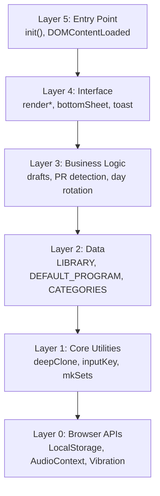

# Architecture Layer Stack — K&N Lifts

## Overview
Single-file web application (`workout-app.html`, 2385 lines). Zero external dependencies. All CSS, HTML, and JS are inline. Data persists in browser LocalStorage.

---

## Layer Diagram



---

## Layer Details

### Layer 0: Browser APIs
No external packages. Direct browser API usage:
- **LocalStorage** — all persistence (`kn-lifts-v3` key)
- **AudioContext / webkitAudioContext** — rest timer beep (graceful fallback)
- **Vibration API** — haptic feedback on timer complete (graceful fallback)
- **DOM APIs** — querySelector, classList, innerHTML rendering

### Layer 1: Core Utilities (line ~1009–1076)
| Function | Purpose |
|----------|---------|
| `deepClone(o)` | JSON round-trip clone |
| `inputKey(blockId, exIdx, setIdx, field)` | Encode draft input keys (`"d1-a\|0\|0\|w"`) |
| `mkSets(n, defaults)` | Factory for exercise set arrays |
| `loadStore()` | Read + parse from LocalStorage |
| `saveStore()` | Serialize + write to LocalStorage |
| `userData()` | Get current user object |
| `updateUser(fn)` | Mutate current user and auto-save |
| `addUser(name)` | Create new user with default program |
| `switchUser(id)` | Change active user |

### Layer 2: Data Layer (lines 801–1007)
| Constant | Content |
|----------|---------|
| `LIBRARY` | 86 exercises, 9 categories (Squat, Hinge, Push, Pull, Arms, Shoulders, Core, Carry, Conditioning) |
| `LIB_BY_ID` | Lookup map: exercise ID → exercise object |
| `DEFAULT_PROGRAM` | 5-day program template with blocks and exercises |
| `CATEGORIES` | Ordered category list with color assignments |
| `STORAGE_KEY` | `"kn-lifts-v3"` |

**Store Schema:**
```js
{
  unit: "lbs" | "kg",
  users: [{
    id: "u_<ts>_<rand>",
    name: string,
    program: Day[],        // deep clone of DEFAULT_PROGRAM
    sessions: Session[],   // max 365
    draft: null | { dayId, startedAt, inputs: {} },
    lastDoneDayId: number | null
  }],
  currentUserId: string | null
}
```

### Layer 3: Business Logic (lines 1121–1223)
| Module | Lines | Purpose |
|--------|-------|---------|
| Day Rotation | 1121–1138 | `determineDefaultDay()`, `getCurrentDay()` — auto-advance after finish |
| Draft Management | 1141–1193 | `getDraft()`, `savInput()`, `getInput()`, `ensureDraft()` — auto-save inputs |
| Program Editing | 1196–1223 | `mutateDay()`, `resetCurrentDay()`, `resetAllProgram()` |
| PR Detection | 1757–1845 | Brzycki formula: `weight × (1 + reps/30)` — compares against all prior sessions |
| Finish Workout | 1757–1845 | Save session, detect PRs, advance day, clear draft |

### Layer 4: Interface (lines 1226–2128)
| Module | Lines | Purpose |
|--------|-------|---------|
| Workout Render | 1226–1456 | `renderWorkoutScreen()` — blocks, exercises, set rows, RPE slider |
| Helpers | 1458–1468 | Utility render functions |
| Bottom Sheets | 1470–1747 | Day picker, exercise library browser, edit menus |
| Rest Timer | 1848–1947 | FAB button, circular progress, presets, audio beep + vibration |
| History | 1949–2047 | Session list, 30-day muscle group donut chart (SVG) |
| Tools | 2049–2092 | Plate calculator (multi-bar), 1RM estimator |
| Export | 2094–2106 | JSON data backup download |
| Toast + Nav | 2108–2128 | Notifications, bottom tab navigation |

### Layer 5: Entry Point (lines 2130–2385)
| Function | Purpose |
|----------|---------|
| `init()` | Main initialization (line 2341) — loads store, checks first-run, renders |
| `initUserPicker()` | Wire user management events |
| `initNav()` | Bottom tab navigation setup |
| `initWorkoutScreen()` | Workout screen event delegation |
| Event: `DOMContentLoaded` | Calls `init()` |
| `window.*` exports | Expose internals for test harness (line 2375) |

---

## Key Patterns

### Data Flow
```
User Input → savInput() → updateUser(fn) → saveStore() → re-render
```

### Render Pattern
All render functions clear `innerHTML` and rebuild from scratch. No virtual DOM or diffing.

### ID Conventions
| Prefix | Entity | Example |
|--------|--------|---------|
| `u_` | User | `u_1713100000000_abc` |
| `s-` | Session | `s-1713100000000` |
| `d1-a` | Day-Block | Day 1, Block A |

### CSS Architecture
- CSS variables for theming (`:root` block, line 9)
- BEM-ish class naming: `.exercise-card`, `.set-row`, `.day-bar`
- Body class `.editing` toggles edit mode styles
- Dark theme only

---

*Generated: 2026-04-14 | Source: workout-app.html (2385 lines)*
